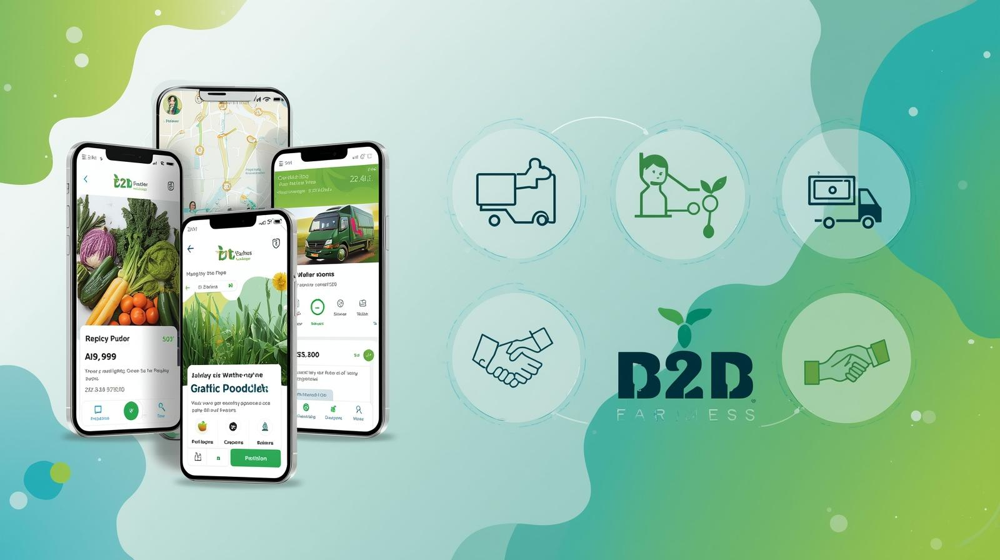

## 

# Farmers Market Platform

## 30.09.2025

Vishwaraja Pathi  
Adiyogi Tech

---

# Overview

A comprehensive B2B platform connecting farmers, buyers, and logistics partners with transparent pricing and streamlined operations.  
The platform features a unified onboarding experience that seamlessly transitions users into dedicated mobile applications based on their role, similar to Zerodha's multi-product ecosystem (Kite, Streak, Coin).

# Goals

1. **Buyer App - Core Platform**: Build the primary FarmConnect Buyer app for wholesalers/retailers to browse products, negotiate prices, request quotes, and place bulk orders - the main revenue-generating workflow.

2. **Unified Onboarding**: Create a seamless registration process that funnels users into their specialized applications, with emphasis on buyer acquisition.

3. **Seller & Logistics Support**: Develop supporting applications (Seller App, Logistics App) to enable the buyer ecosystem and complete the marketplace.

4. **Admin Management**: Build admin tools to oversee the platform, approve sellers, and ensure smooth buyer-seller transactions.

5. **Cross-Platform Experience**: Deliver desktop + mobile applications for all personas, with buyer app as the flagship product.

# Specifications

- **Target Users / Personas**
  - **Buyers** – Browse approved products, request quotes (RFQs), counter quotes, place orders, and track order status.
  - **Sellers** – Submit product details for admin approval, track product status, and manage notifications/orders.
  - **Logistics Partners** – Manage assigned deliveries, update delivery statuses (picked up, in transit, delivered).
  - **Admin** – Oversee buyers, sellers, logistics partners, products, quotes, payments, and order tracking; approve products and assign logistics.

- **Key Workflows**
  - **Unified Onboarding**: All users register through a single process → Role selection → Account verification → Access desktop/mobile app.
  - **Buyer App**: Browse approved products → Request quotes (RFQs) → Negotiate/counter quotes → Place orders → Track delivery status (Desktop + Mobile).
  - **Seller App**: Submit products for approval → Track approval status → Manage orders → Update inventory → Handle notifications (Desktop + Mobile).
  - **Logistics App**: Accept assigned deliveries → Update pickup status → Track in-transit → Mark delivered → Generate delivery reports (Desktop + Mobile).
  - **Admin App**: Approve sellers & products → Manage user accounts → Assign logistics → Monitor payments → Track system analytics (Desktop + Mobile).

- **Platform Architecture**
  - **Public Website**: Home page + 4-5 inner pages for platform information and user registration
  - **Dedicated Applications**: 
    - **FarmConnect Buyer**: Desktop + Mobile app for wholesalers/retailers
    - **FarmConnect Seller**: Desktop + Mobile app for farmers/producers
    - **FarmConnect Logistics**: Desktop + Mobile app for delivery partners
    - **FarmConnect Admin**: Desktop dashboard + Mobile app for field operations
  - **Unified Authentication**: Single sign-on with role-based access control

- **Core Features**
  - Unified user onboarding & role management
  - Product catalog & advanced search  
  - RFQ and bidding system  
  - Order management & real-time tracking  
  - Payments (UPI/other integrations)  
  - Logistics assignment & tracking  
  - Notifications & alerts  
  - Multilingual support

# Milestones

1. **Phase 1** – Unified onboarding system, public website, core desktop + mobile apps (Buyer, Seller), product catalog, and RFQ system.  
2. **Phase 2** – Logistics desktop + mobile app, admin desktop + mobile solution, payments integration, and real-time tracking.  
3. **Phase 3** – Advanced features, analytics dashboards, performance optimization, and cross-platform synchronization.

---